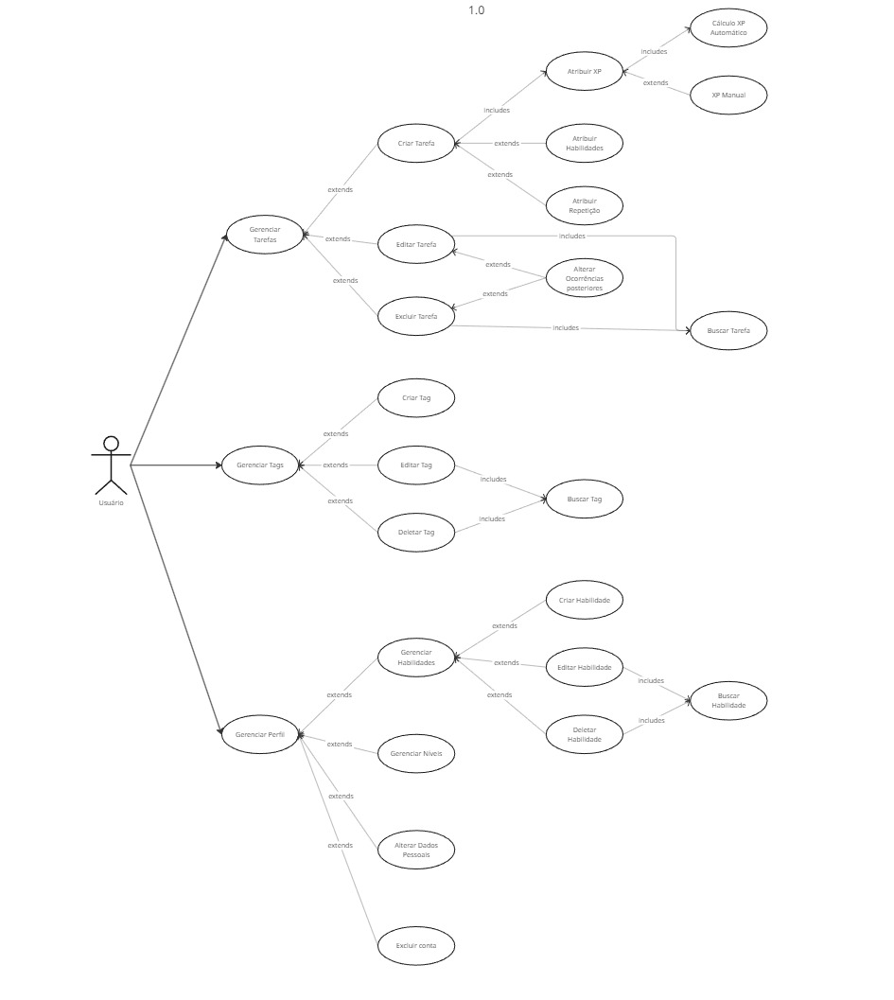
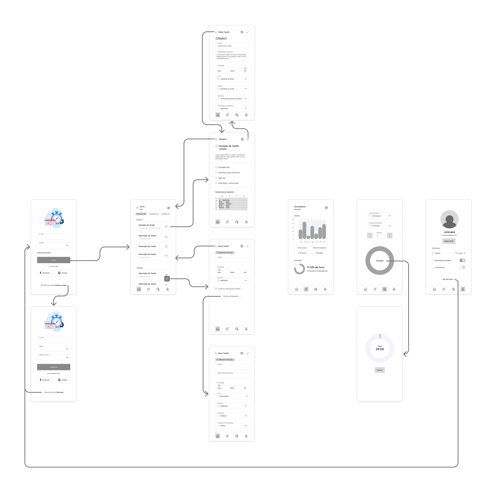

# ✅ Level Me Up

## 📌 Descrição do Projeto
**Level Me Up** é uma aplicação que combina organização pessoal com mecânicas de jogos (RPG). 
O objetivo é tornar o gerenciamento de tarefas mais engajador, permitindo que o usuário ganhe 
XP e suba de níveis ao concluir suas atividades diárias.

Este projeto nasceu inicialmente como parte da disciplina de *Projeto de Interface Web* no 
curso de Sistemas para Internet do IFTO (Campus Palmas) como uma simples *Task List*, 
e agora está sendo evoluído com foco em arquitetura de software escalável.

---

## ⚙️ V1.0 - MVP (Em desenvolvimento)
O foco atual é o "Core Loop" da gamificação:
- 📅 **Tarefas:** Criar, Editar (Regras e Exceções), Excluir e Concluir.
- 🧮 **Gamificação Básica:** Ganho de XP, Barra de Progresso e Níveis.
- 💪 **Habilidades:** Vincular tarefas a habilidades específicas (ex: "Programação").
- 🚩 **Tags:** Organização por etiquetas coloridas.
- 👤 **Perfil:** Login e Visualização de estatísticas básicas.

## 🤖 Roadmap (Futuro)
- 📈 Relatório de desempenho e gráficos
- ⏰ Pomodoro Timer
- 🌙 Tema escuro (Dark Mode)
- 🔔 Notificações de lembrete
- 🌳 Árvore de Habilidades (Habilidades com sub-habilidades)
- 🗂️ Tipos de Tarefas: 
  - Normal (*Padrão*)
  - Contagem (Vezes, Minutos, Horas, Litros, Páginas)
  - Hábito Bom 
  - Hábito Ruim
- 💀 Sistema de Hábitos Ruins e Punições.
- 🪙 Moedas
- 🏪 Loja Virtual

## 💻 Tecnologias Utilizadas
**Front-end:**
- [Angular](https://angular.io/) (Framework principal)
- TypeScript (Lógica e Tipagem)
- SCSS (Estilização)

**Back-end (BaaS):**
- [Firebase Firestore](https://firebase.google.com/) (Banco de Dados NoSQL)
- Firebase Authentication (Gestão de Usuários)
- Firebase Hosting (Hospedagem)

---

## 📄 Documentação
Está sendo documentado através do Obsidian.
- 📋 [Requisitos Funcionais e Não Funcionais](docs/Requisitos_1.0.md)
- 📖 [Detalhamento de Casos de Uso](docs/Casos-de-Uso_1.0.md)

### 🗺️ Diagramas
Junto aos wireframes está sendo feito os diagramas usando o 'Miro':

- 

### 🎨 Wireframe

O projeto foi desenvolvido com base em um **wireframe** previamente planejado, utilizando a ferramenta 'Figma'.

---

## 🚀 Como Executar o Projeto
> Pré-Requisitos:
> - Node.js
> - Angular CLI
> - Git

1. Acesse o terminal;  

2. Clone o repositório:
  ``git clone https://github.com/JunoPLupus/web-mobile-tasks-app``  

3. Navegue até o diretório do projeto:
   ``cd web-mobile-tasks-app``  

4. Instale as dependências:
  ``npm install``  

5. Inicie o servidor de desenvolvimento:
  ``ng serve`` ou ``npm serve --open``(se preferir abrir automaticamente no navegador).  

6. Abra o navegador e acesse:
  ``http://localhost:4200``  

---

📝 Licença
Este projeto está sob a licença MIT. Veja o arquivo LICENSE para mais detalhes.

---

Desenvolvido por Juno Piazza Lopes (JunoPLupus 🐺).
